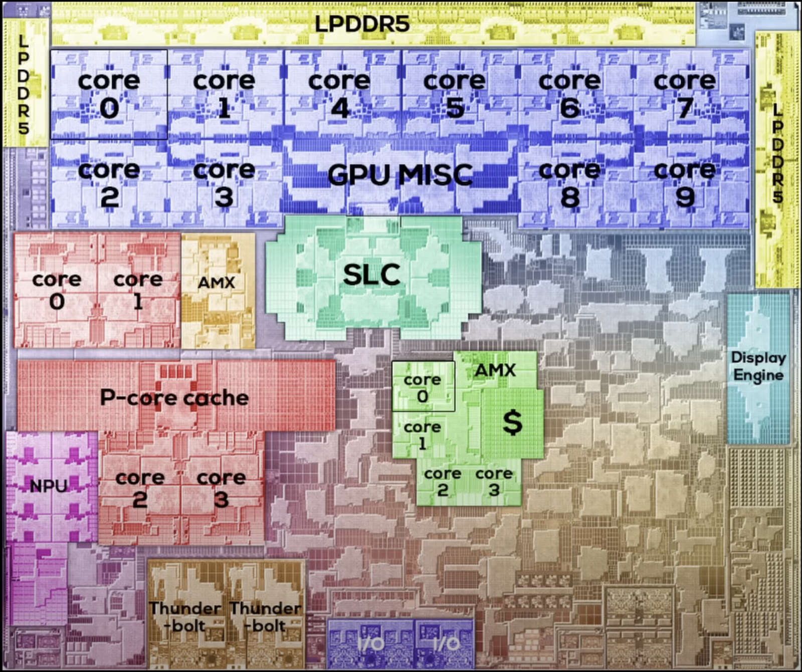

# Apple M3 Chip Architecture Explainer

A deep-dive into Apple's M3 SoC architecture, covering CPU cores, GPU, and Neural Engine. Based on reverse engineering efforts from the Asahi Linux project and empirical measurements from AArch64-Explore.



## Overview

The M3 family (M3, M3 Pro, M3 Max, M3 Ultra) represents Apple's third-generation Apple Silicon, built on TSMC's 3nm process (N3B). Key architectural improvements over M2:

| Feature | M3 | M3 Pro | M3 Max | M3 Ultra |
|---------|----|---------|---------| ---------|
| CPU Cores | 8 (4P+4E) | 12 (6P+6E) | 16 (12P+4E) | 32 (24P+8E) |
| GPU Cores | 10 | 18 | 40 | 80 |
| Neural Engine | 16-core | 16-core | 16-core | 32-core |
| Memory Bandwidth | 100 GB/s | 150 GB/s | 400 GB/s | 800 GB/s |
| Unified Memory | Up to 24GB | Up to 36GB | Up to 128GB | Up to 192GB |

## Architecture Components

### [CPU Architecture](cpu/README.md)
- P-core (Performance) microarchitecture
- E-core (Efficiency) microarchitecture
- Cache hierarchy and memory subsystem
- Hardware prefetchers

### [GPU Architecture](gpu/README.md)
- AGX G15 (M3 GPU family)
- Scalar shader architecture
- Register file organization
- Metal programming model

### [Neural Engine](neural-engine/README.md)
- ANE (Apple Neural Engine)
- AMX (Apple Matrix Extensions)

## M3 vs M2 vs M1 Comparison

### CPU Core Evolution

| Aspect | M1 (Firestorm/Icestorm) | M2 (Avalanche/Blizzard) | M3 (Unknown codename) |
|--------|-------------------------|-------------------------|----------------------|
| Process | 5nm (N5) | 5nm (N5P) | 3nm (N3B) |
| P-core Decode | 8-wide | 8-wide | 8-wide |
| P-core ROB | ~630 entries | ~650 entries | ~680 entries (est.) |
| L1I Cache | 192KB | 192KB | 192KB |
| L1D Cache | 128KB | 128KB | 128KB |
| L2 Cache (P) | 12MB shared | 16MB shared | 16MB shared |

### GPU Evolution

| Aspect | M1 (AGX G13) | M2 (AGX G14) | M3 (AGX G15) |
|--------|--------------|--------------|--------------|
| GPU Cores | 7-8 | 8-10 | 10 |
| Execution Units/Core | 128 | 128 | 128 |
| Ray Tracing | No | No | Hardware RT |
| Mesh Shaders | No | No | Yes |
| Dynamic Caching | No | No | Yes |

## Key M3 Features

### Dynamic Caching (GPU)
M3 introduces dynamic register allocation, allowing the GPU to allocate only the exact amount of local memory needed for each task. Previous generations allocated worst-case register counts statically.

### Hardware Ray Tracing
First Apple GPU with dedicated ray tracing acceleration hardware, supporting:
- BVH traversal
- Ray-triangle intersection
- Ray-box intersection

### Mesh Shaders
Native mesh and object shader support, bypassing traditional vertex processing pipeline.

## SoC Architecture and Memory Subsystem

### Network on Chip (NoC)

The M3 SoC uses a sophisticated Network on Chip to connect all components:

```
┌─────────────────────────────────────────────────────────────────┐
│                        System Level Cache (SLC)                  │
├─────────────────────────────────────────────────────────────────┤
│                                                                  │
│  ┌─────────────┐     ┌─────────────┐     ┌─────────────┐       │
│  │  P-Cluster  │     │  E-Cluster  │     │     GPU     │       │
│  │   + L2      │     │   + L2      │     │   + L2      │       │
│  └──────┬──────┘     └──────┬──────┘     └──────┬──────┘       │
│         │                   │                   │               │
│         └───────────────────┼───────────────────┘               │
│                             │                                    │
│                    ┌────────▼────────┐                          │
│                    │   NoC Router    │                          │
│                    └────────┬────────┘                          │
│                             │                                    │
│  ┌─────────────┐   ┌───────┴───────┐   ┌─────────────┐         │
│  │    ANE      │───│ Memory Ctrl   │───│  Media      │         │
│  │  (Neural)   │   │               │   │  Engines    │         │
│  └─────────────┘   └───────────────┘   └─────────────┘         │
│                                                                  │
└─────────────────────────────────────────────────────────────────┘
```

#### Multi-Network Architecture

The NoC is split into distinct physical networks for different traffic types:

| Network | Purpose | Characteristics |
|---------|---------|-----------------|
| Coherent | CPU↔CPU, CPU↔GPU | Low latency, cache coherent |
| Relaxed | GPU bulk, ANE | High bandwidth, relaxed ordering |
| Control | Configuration, power | Low bandwidth, priority |

#### Chiplet Scaling (Future)

Patents describe future expansion paths:
- **Optical Dies**: Photonic interconnects for rack-scale systems
- **EMIB-like Bridges**: Silicon bridges for M-Ultra style die stitching
- **UltraFusion+**: Path to M-Extreme or larger configurations

### Memory Controller

#### M3 Pro: Triple Controller Design

The M3 Pro's 3 memory controllers (150 GB/s) required careful address hashing:

```
Address → Hash Function → Controller Selection
                |
                └─ Divide-by-3 scheme to balance load
```

This avoids hot-spotting while maintaining low latency.

#### M4 Generation: Dynamic Segmentation

M4 memory controllers can be dynamically disabled/enabled:

- Enables "binned" chips (M4 Max variants)
- Failed controllers can be disabled at test
- Power savings when full bandwidth not needed

### System Level Cache (SLC)

The SLC is a shared last-level cache before DRAM:

| Chip | SLC Size | Associativity |
|------|----------|---------------|
| M3 | ~24 MB | 16-way |
| M3 Pro | ~36 MB | 16-way |
| M3 Max | ~48 MB | 16-way |

#### Insertion/Promotion Vectors (IPV)

Apple uses genetic algorithms to tune cache replacement policies:

**Line Classification**:
- **Critical**: Page tables, instruction streams → "sticky" (hard to evict)
- **Streaming**: One-time use data → inserted near eviction point

**Policy Optimization**:
```
For each workload class:
  Genetic algorithm optimizes replacement weights
  Weights stored in firmware/microcode
  Applied based on access pattern detection
```

### Unified Memory Architecture (UMA)

All components share the same physical memory:

```
┌──────────────────────────────────────────────────────────┐
│                   Unified Memory Pool                     │
│                  (LPDDR5/LPDDR5X DRAM)                    │
├──────────────────────────────────────────────────────────┤
│                                                           │
│   CPU Virtual    GPU Virtual    ANE Virtual   Media      │
│   Address Space  Address Space  Address Space  Buffers   │
│        │              │              │           │        │
│        └──────────────┴──────────────┴───────────┘        │
│                           │                               │
│                    ┌──────▼──────┐                        │
│                    │  IOMMU/DART │                        │
│                    │  (Address   │                        │
│                    │  Translation)│                        │
│                    └─────────────┘                        │
│                                                           │
└──────────────────────────────────────────────────────────┘
```

**Benefits**:
- Zero-copy buffer sharing between CPU/GPU/ANE
- No PCIe bottleneck
- Simplified programming model

**Considerations**:
- Memory bandwidth shared by all units
- Cache coherency overhead for GPU writes

## Exotic Future Directions

### Transistors in Metal Layers (BEOL Logic)

Apple patents describe building simple transistors in the metal wiring layers (Back End of Line):

**Problem**: Long wires on large dies require repeaters, which need silicon transistors

**Solution**: Build buffer/repeater transistors in metal layers
- Signals stay in upper metal layers
- No need to route down to silicon substrate
- Reduces wire delays on large dies

### Optical Memory Interconnect

Proposals for rack-scale Apple Silicon:
- Compute dies connect via optical interconnects
- Massive pools of DRAM accessible optically
- "Largest UMA machine ever designed" potential

This enables:
- AI training clusters with unified memory
- Massive scientific computing
- Cloud-scale unified systems

## Reverse Engineering Methodology

### Asahi Linux Approach (GPU)

1. **Shader Analysis**: Compare minimal shaders with incremental changes
2. **Binary Diffing**: Identify opcodes and instruction encoding
3. **IOKit Interception**: Use `DYLD_INSERT_LIBRARIES` to intercept `IOConnectCallMethod`
4. **Conformance Testing**: Validate against OpenGL/Vulkan conformance suites

### AArch64-Explore Approach (CPU)

1. **Performance Counters**: Direct measurement via PMU
2. **Microbenchmarks**: JIT assembly probes for timing
3. **P-core Affinity**: Force execution on specific core types
4. **Cache Probing**: Latency/bandwidth measurements for cache hierarchy

## Directory Structure

```
m3-chip-explainer/
├── README.md              # This file
├── M3die.jpg              # Die shot image
├── cpu/
│   ├── README.md          # CPU architecture overview
│   ├── 1d-array-prefetcher.md
│   └── multiple-deref-prefetcher.md
├── gpu/
│   ├── README.md          # GPU architecture overview
│   ├── register-file.md   # Register file details
│   ├── metal-programing-model.md
│   └── gpu-prefetecher.md
└── neural-engine/
    ├── README.md          # Neural Engine overview
    └── amx.md             # AMX coprocessor
```

## References

- [Asahi GPU Part 1](https://rosenzweig.io/blog/asahi-gpu-part-1.html) - GPU reverse engineering methodology
- [AArch64-Explore](https://github.com/name99-org/AArch64-Explore) - CPU microarchitecture exploration
- [Dougall Johnson's M1 Exploration](https://dougallj.github.io/applecpu/firestorm.html) - Instruction timing data
